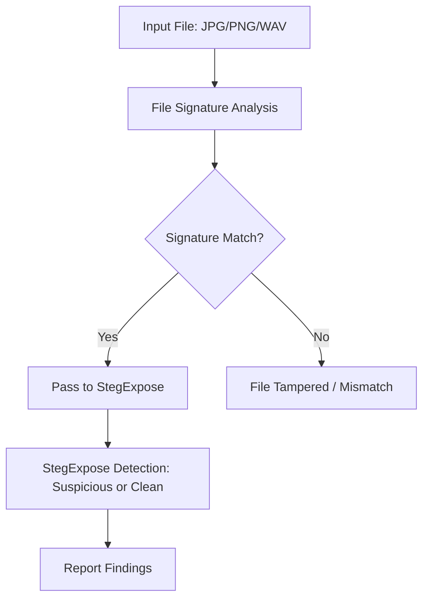

# Detecting-steganography-with-tools-like-StegExpose-analyzing-file-signatures
## AIM:
To detect hidden data using steganography detection tools like StegExpose and analyze file signatures for authenticity and manipulation.
## Requirements:
- **Operating System:** Linux / Windows
- **Tools:**
    - StegExpose (Java-based tool)
    - Hex Editor (e.g., xxd, HxD)
    - File command (Linux) or TrID (Windows)
- **Sample files:**
    - Suspected stego files (.jpg, .png, .wav)
    - Clean reference files
## ARCHITECTURE DIAGRAM:


## DESIGN STEPS:
### Step 1:
Install StegExpose or use the JAR version to detect steganography in image files.

### Step 2:
Run StegExpose on a directory of suspected image files using the command:

### Step 3:
Analyze file signatures using tools like file, binwalk, or xxd to check for inconsistencies or embedded content.

## PROGRAM:
**Check file type**
```bash
file suspect.jpg
```
or view magic bytes:
```
xxd suspect.jpg | head
```
**Run StegExpose**
```bash
java -jar StegExpose.jar suspect.jpg
```
## OUTPUT:


List of Images with Steganography Detection Scores and File Signature Details

## RESULT:
Hidden data was successfully detected and file signatures were analyzed for irregularities.
